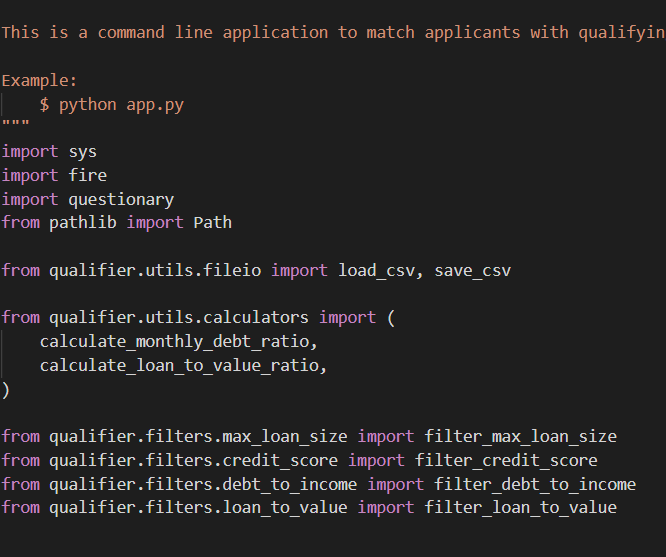
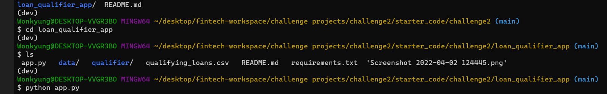
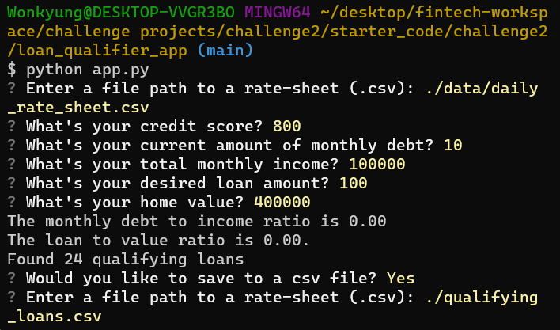

# Loan Qualifier Application

This application automates the loan qualification process by identifying banks whose lending criteria matches the profile of the borrower. The output is then saved to a csv file if the file is not empty. 

---

## Technologies

This application can be run in the Windows operating system and uses Python as the main programming language. You can use any terminal program such as gitbash along with an editing workspace, i.e., VS Code. The following libraries and modules are imported to run this app: Fire, Sys, Questionary, and Pathlib.  

---

## Installation Guide

See the required programs and contingencies to install prior to running application - 

Following imports are provided as shown in the screenshot: 

---

## Usage

This application is a Command Line Interface or CLI that can be used to dynamically filter the list of banks offering loans to fit a customer's financial profile. 

In the terminal, Activate the Dev environment: Conda Activate Dev. 

Then navigate to the directory containing the app.py file and run it using Python command. 

Follow the prompts the generate the qualifying loan file: 

---

